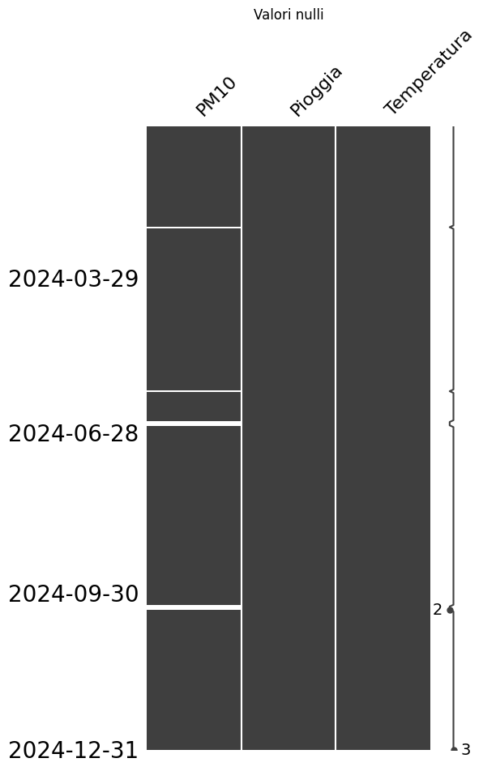
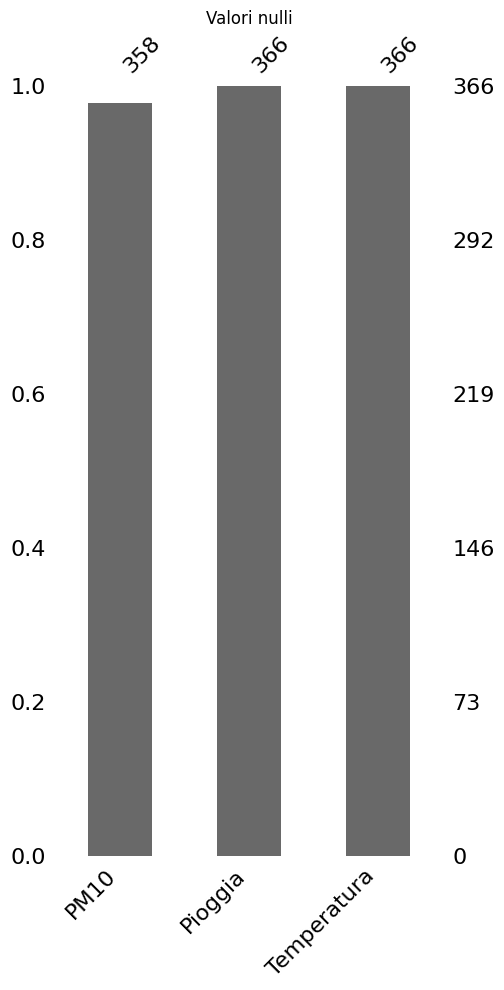
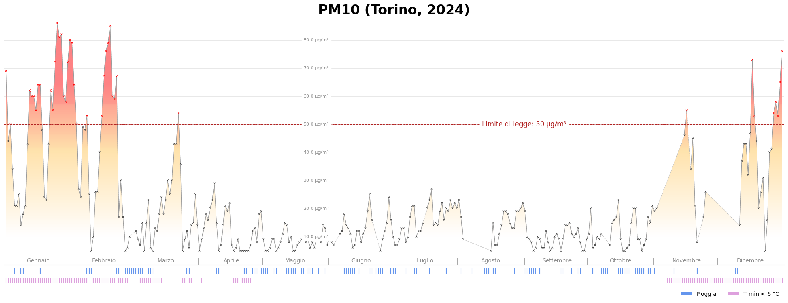
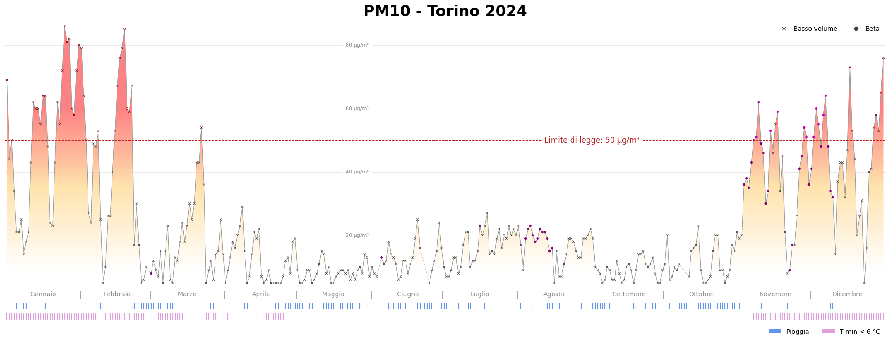

*Picture by [Fabio Fistarol](https://unsplash.com/it/@fabiofistarol?utm_content=creditCopyText&utm_medium=referral&utm_source=unsplash) on [Unsplash](https://unsplash.com/it/foto/veduta-aerea-degli-edifici-della-citta-durante-il-giorno-VjA_PSSsOHI?utm_content=creditCopyText&utm_medium=referral&utm_source=unsplash)*

# Air Pollution Analysis: PM10 in Turin (2024)


[Italiano](README-IT.md)

This project aims to effectively visualize the daily PM10 levels in Turin in 2024. Data is analyzed in relation to precipitation and heating system usage. Statistical tests have also been conducted to evaluate the impact of these factors on air pollution.

## Table of Contents

- [Repository Structure](#repository-structure)
- [Installation and Setup](#installation-and-setup)
   - [Resources Used](#resources-used)
   - [Python Libraries](#python-libraries)
- [Data](#data)
- [Analysis and Results](#analysis-and-results)
   - [Data Cleaning](#data-cleaning)
   - [Data Visualization](#data-visualization)
   - [Analysis](#analysis)
   - [Results](#results)
- [Future Developments](#future-developments)
- [License](#license)

## Repository Structure
The repository structure is as follows:

```bash
│── data/                                       # Folder containing CSV files
│── src/                                        # Contains Python scripts
│   │── main.py                                 # Main script
│   │── utils.py                                # Utility functions (e.g., data loading and cleaning)
│   │── visualization.py                        # Functions for creating charts
│   │── statistical_tests.py                    # Functions for statistical tests and models
│── img/                                        # Images
│   │── cross_correlation_chart_Pioggia.pdf                
│   │── cross_correlation_chart_Pioggia.png                
│   │── cross_correlation_chart_Temperatura.pdf            
│   │── cross_correlation_chart_Temperatura.png            
│   │── pm10_torino.pdf                
│   │── pm10_torino.png                
│── requirements.txt                            # Python dependencies
│── README.md                                   # Project documentation
│── .gitignore                 
```

## Installation and Setup
1. Clone the repository:
   ```bash
   git clone https://github.com/alriss/torino_pm10_analysis.git
   cd torino_pm10_analysis
   ```
2. Install dependencies:
   ```bash
   pip install -r requirements.txt
   ```
3. Run the main script:
   ```bash
   python src/main.py
   ```

### Resources Used
Software Information:
- **Editor:** Visual Studio Code
- **Python:** Python 3.13.1

### Python Libraries
The required libraries are listed in the `requirements.txt` file. They can be categorized as follows:
- **Data Manipulation:** `pandas, numpy`
- **Data Visualization:** `matplotlib`
- **Data Analysis:** `statsmodels, scipy`

## Data

- **Torino_Lingotto_PM10_2024.csv:** Daily PM10 levels measured using the gravimetric method from the [Torino - Lingotto](https://webgis.arpa.piemonte.it/secure_apps/qualita_aria/dati_anagrafici/index.php?NUMCODICE=001272-806) station (source: [ARPA](https://aria.ambiente.piemonte.it/qualita-aria/dati)).

- **Torino_Vallere_precipitazioni_2024.csv:** Daily rainfall height from the Torino - Vallere station (source: [ARPA](https://www.arpa.piemonte.it/rischi_naturali/snippets_arpa_graphs/dati_giornalieri_meteo/?statid=PIE-001272-904-2001-05-17&param=P)). This [guide](https://www.arpa.piemonte.it/rischi_naturali/document/Guida_alla_lettura_dati_meteo_-_Banca_Dati_Storica.pdf) provides additional information.

- **Torino_Vallere_temperature_2024.csv:** Daily temperature recorded by the Torino - Vallere station (source: [ARPA](https://www.arpa.piemonte.it/rischi_naturali/snippets_arpa_graphs/dati_giornalieri_meteo/?statid=PIE-001272-904-2001-05-17&param=T)). This [guide](https://www.arpa.piemonte.it/rischi_naturali/document/Guida_alla_lettura_dati_meteo_-_Banca_Dati_Storica.pdf) provides additional information.

### Data Preprocessing
- **PM10:** The dataset was filtered for `Id Parametro='PM10_GBV'` to retain only gravimetric method measurements. The columns used are `Data rilevamento` and `Valore`.
- **Precipitation:** The columns used are `DATA` and `Precipitazione (mm)`. For analysis, `Precipitazione (mm)` was converted into a binary flag, creating a new feature: the new column has a value of 1 if the measurement is > 0, otherwise 0, to distinguish rainy days from non-rainy ones regardless of the rainfall amount.
- **Temperature:** The columns used are `DATA` and `Temperatura minima`. For analysis, `Temperatura minima` was converted into a binary flag, creating a new feature: the new column has a value of 1 if the measurement is <`temp_thr` (arbitrarily set to 6, adjustable in the script), otherwise 0, to distinguish days when the minimum temperature dropped below the threshold from those when it did not.

## Analysis and Results

### Data Cleaning
- Removal of null values and handling of anomalies.

 

- Conversion of time columns to datetime format for better manipulation.
- Creation of new binary features for precipitation (>0 mm) and presumed heating usage (minimum temperature <6°C), useful for subsequent analyses.

### Data Visualization
- Line chart to highlight PM10 level trends over time.
- Event plot to visualize the distribution of precipitation and minimum temperature below the chosen threshold.
- Lollipop plot to show the correlation between variables for different lag values (time shifts).




### Analysis
- **Linear Regression** to estimate the impact of precipitation and temperature on PM10 levels.
- **Correlation Analysis:**
  - Spearman test to assess the direct relationship between variables (lag = 0).
  - Cross-correlation function (CCF) to verify delayed effects (lag > 0).
  - Granger causality test to determine the temporal causality between temperature, rain, and PM10.

### Results
- **Combined Effect:** Analysis suggests that a combination of low temperatures and lack of precipitation significantly increases PM10 levels.
- **Rainfall Effects:** On rainy days, a reduction in PM10 concentration is observed.
- **Heating Effects:** Days with minimum temperatures below 6°C tend to show increased air pollution levels.

## Future Developments

- **Forecasting Model:** Implementation of a `prophet`-based model to predict PM10 levels using historical data.
- **Daily Prediction:** Development of a predictive model using rain and temperature data to estimate real-time PM10 levels. This would be useful for issuing rapid alerts, considering that official measurements require laboratory analysis.

## License
MIT License

Copyright (c) 2025 Alberto Rissone

Permission is hereby granted, free of charge, to any person obtaining a copy
of this software and associated documentation files (the "Software"), to deal
in the Software without restriction, including without limitation the rights
to use, copy, modify, merge, publish, distribute, sublicense, and/or sell
copies of the Software, and to permit persons to whom the Software is
furnished to do so, subject to the following conditions:

The above copyright notice and this permission notice shall be included in all
copies or substantial portions of the Software.

THE SOFTWARE IS PROVIDED "AS IS", WITHOUT WARRANTY OF ANY KIND, EXPRESS OR
IMPLIED, INCLUDING BUT NOT LIMITED TO THE WARRANTIES OF MERCHANTABILITY,
FITNESS FOR A PARTICULAR PURPOSE AND NONINFRINGEMENT. IN NO EVENT SHALL THE
AUTHORS OR COPYRIGHT HOLDERS BE LIABLE FOR ANY CLAIM, DAMAGES OR OTHER
LIABILITY, WHETHER IN AN ACTION OF CONTRACT, TORT OR OTHERWISE, ARISING FROM,
OUT OF OR IN CONNECTION WITH THE SOFTWARE OR THE USE OR OTHER DEALINGS IN THE
SOFTWARE.