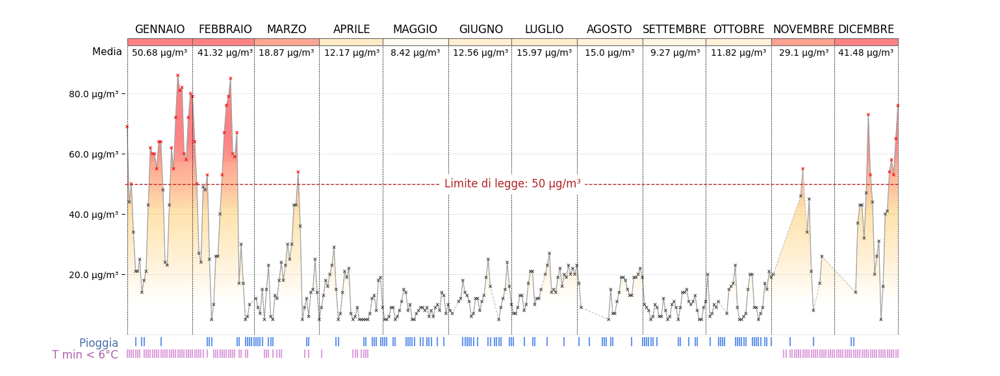

# Analisi PM10 a Torino


 
 

Questo progetto ha l'obiettivo di visualizzare in modo efficace i livelli giornalieri di PM10 a Torino nel 2024. Il dato viene messo in relazione con le precipitazioni e l'utilizzo degli impianti di riscaldamento. Inoltre sono state effettuati dei test statistici per valutare l'effetto di questi fattori sull'inquinamento atmosferico.

## Indice

1. [Dati](#dati)
2. [Struttura della repository](#struttura-della-repository)
3. [Installazione](#installazione)
4. [Analisi e risultati](#analisi-e-risultati)
5. [Sviluppi futuri](@sviluppi-futuri)
6. [Licenza](#licenza)

## Dati

- **Torino_Lingotto_PM10_2024.csv**: dati relativi ai livelli giornalieri di PM10 messi a disposizione da [ARPA](https://aria.ambiente.piemonte.it/qualita-aria/dati), in particolare si tratta delle misurazioni dal 1/1/2024 al 31/12/2024 della stazione [Torino - Lingotto](https://webgis.arpa.piemonte.it/secure_apps/qualita_aria/dati_anagrafici/index.php?NUMCODICE=001272-806) ottenute con metodo gravimetrico.

- **Torino_Vallere_precipitazioni_2024.csv**: dati relativi alle precipitazioni messi a disposizione da [ARPA](https://www.arpa.piemonte.it/rischi_naturali/snippets_arpa_graphs/dati_giornalieri_meteo/?statid=PIE-001272-904-2001-05-17&param=P), in particolare si tratta  dell’altezza della pioggia caduta dalle 00:00 alle 24:00 dei giorni dal 1/1/2024 al 31/12/2024. Le misurazioni provengono dalla stazione Torino - Vallere. La [guida](https://www.arpa.piemonte.it/rischi_naturali/document/Guida_alla_lettura_dati_meteo_-_Banca_Dati_Storica.pdf) fornisce informazioni aggiuntive.

- **Torino_Vallere_temperature_2024.csv**: dati relativi alla emperatura messi a disposizione da [ARPA](https://www.arpa.piemonte.it/rischi_naturali/snippets_arpa_graphs/dati_giornalieri_meteo/?statid=PIE-001272-904-2001-05-17&param=T), in particolare si tratta  della temperatura minima dei giorni dal 1/1/2024 al 31/12/2024. Le misurazioni provengono dalla stazione Torino - Vallere. La [guida](https://www.arpa.piemonte.it/rischi_naturali/document/Guida_alla_lettura_dati_meteo_-_Banca_Dati_Storica.pdf) fornisce informazioni aggiuntive. 

## Struttura della repository
La struttura della repository è la seguente:

```bash
│── data/                      # Cartella con i file CSV
│── src/                       # Contiene gli script Python
│   │── main.py                # Script principale
│   │── utils.py               # Funzioni utili (es. caricamento e pulizia dei dati)
│   │── visualization.py       # Funzioni per la creazione dei grafici
│   │── statistical_tests.py   # Funzioni per test statistici e modelli
│── requirements.txt           # Dipendenze Python
│── README.md                  # Documentazione del progetto
│── .gitignore                 
```

## Installazione
1. Clona la repository:
   ```bash
   git clone https://github.com/tuo-username/torino_pm10_analysis.git
   cd torino_pm10_analysis
2. Installa le dipendenze:
   ```bash
   pip install -r requirements.txt
3. Esegui lo script principale:
   ```bash
   python src/main.py

## Analisi e risultati

## Sviluppi futuri

## Licenza
MIT License

Copyright (c) 2025 Alberto Rissone

Permission is hereby granted, free of charge, to any person obtaining a copy
of this software and associated documentation files (the "Software"), to deal
in the Software without restriction, including without limitation the rights
to use, copy, modify, merge, publish, distribute, sublicense, and/or sell
copies of the Software, and to permit persons to whom the Software is
furnished to do so, subject to the following conditions:

The above copyright notice and this permission notice shall be included in all
copies or substantial portions of the Software.

THE SOFTWARE IS PROVIDED "AS IS", WITHOUT WARRANTY OF ANY KIND, EXPRESS OR
IMPLIED, INCLUDING BUT NOT LIMITED TO THE WARRANTIES OF MERCHANTABILITY,
FITNESS FOR A PARTICULAR PURPOSE AND NONINFRINGEMENT. IN NO EVENT SHALL THE
AUTHORS OR COPYRIGHT HOLDERS BE LIABLE FOR ANY CLAIM, DAMAGES OR OTHER
LIABILITY, WHETHER IN AN ACTION OF CONTRACT, TORT OR OTHERWISE, ARISING FROM,
OUT OF OR IN CONNECTION WITH THE SOFTWARE OR THE USE OR OTHER DEALINGS IN THE
SOFTWARE.
